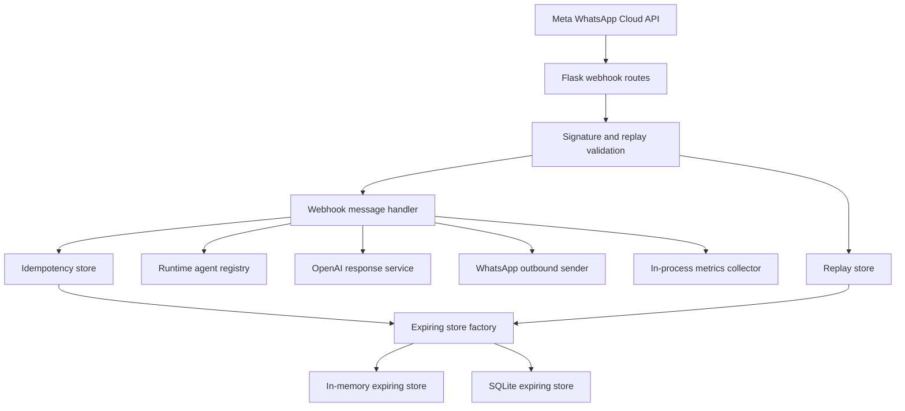

# Architecture Decision Document

## Overview

This architecture supports a Flask-based WhatsApp webhook application that validates inbound Meta requests, deduplicates and secures message handling, dispatches AI-backed replies, and exposes light operational controls for runtime agent selection.

The main architectural direction is to harden reliability without introducing an operationally heavy persistence tier. The current design does that by separating ephemeral reliability state behind a small storage seam, defaulting to in-memory behavior, and enabling an opt-in SQLite backend with automatic fallback when SQLite initialization fails.

## Architecture Goals

1. Keep the webhook path simple enough for local development and fast recovery.
2. Enforce security checks before any message processing.
3. Add reliability controls for duplicate suppression, replay protection, retries, and timeouts.
4. Provide a safe rollout path for persistent reliability state without making SQLite a hard dependency.
5. Ensure runtime-owned resources are cleaned up deterministically.

## System Context

### Primary Runtime Flow

1. Meta sends a signed webhook request to `POST /webhook`.
2. The signature decorator validates the HMAC signature, validates timestamp skew, and rejects replayed signatures.
3. The webhook handler ignores status updates, suppresses duplicate message IDs, and processes valid inbound WhatsApp messages.
4. The response pipeline generates reply text and sends it through the WhatsApp Cloud API.
5. Metrics and structured logs capture request counts, outcomes, durations, and correlation identifiers.

### High-Level Component Map

## Key Decisions

### Decision 1: Flask App Factory Owns Runtime Assembly

The application continues to use a Flask app factory so configuration loading, validation, blueprint registration, and extension lifecycle management stay centralized.

Why:

- Startup validation can fail fast before serving traffic.
- Runtime extensions share one consistent attachment point through `app.extensions`.
- Teardown hooks can close resources without scattering cleanup logic across handlers.

Consequence:

- Reliability components are designed as app-scoped extensions rather than process-global singletons.

### Decision 2: Option 2 Reliability Track Uses a Graduated State Backend

The reliability path now has a real backend rollout strategy:

- Default mode: in-memory expiring store.
- Rollout mode: SQLite-backed expiring store.
- Safety path: if SQLite initialization fails and fallback is enabled, the system degrades to the in-memory store rather than failing the webhook path.

This decision applies to the two reliability-sensitive state seams currently in the app:

- webhook message idempotency
- signature replay detection

Why:

- In-memory state is enough for local development and single-process deployments.
- SQLite adds restart durability and a clearer upgrade path without requiring external infrastructure.
- Fallback keeps the deploy path safe when filesystem access, permissions, or SQLite initialization fail.

Consequence:

- Reliability behavior improves gradually rather than through an all-or-nothing persistence migration.
- Operators can trial SQLite in staging or production with a bounded rollback path.
- The app still tolerates degraded persistence by preserving functional webhook handling.

### Decision 3: Storage Is Hidden Behind a Narrow Expiring Store Interface

The application uses a small storage seam with `seen_recently`, `clear`, and `close` behavior. A factory creates either an in-memory store or a SQLite store and caches the result in `app.extensions`.

Why:

- The webhook and security layers should depend on reliability behavior, not storage details.
- The seam keeps tests simple and allows backend changes without rewriting decorators or handlers.
- Shared semantics across message deduplication and replay detection reduce drift between implementations.

Consequence:

- Future backends such as Redis can be added behind the same interface if concurrency or multi-instance deployment requires it.

### Decision 4: Resource Lifecycle Is Extension-Managed and Closed on App Teardown

Runtime objects that hold external resources expose a `close()` method and are registered in `app.extensions`. The app factory teardown hook iterates extensions and calls `close()` when present.

Why:

- SQLite connections should be closed explicitly instead of relying on interpreter shutdown.
- Handlers and decorators should not own connection cleanup logic.
- A common lifecycle convention avoids leaking backend-specific cleanup into unrelated code paths.

Consequence:

- Extension objects are responsible for idempotent cleanup.
- In-memory extensions can expose a no-op `close()` to conform to the same lifecycle contract.

## Runtime Architecture

### Inbound Edge

- `GET /webhook` handles Meta verification.
- `POST /webhook` is guarded by the signature decorator.
- The signature layer validates the `sha256=` header shape, optional timestamp freshness, and replay safety before business logic runs.

### Message Processing

- Status updates are acknowledged early.
- Valid WhatsApp message payloads are normalized enough to extract message IDs, sender info, and message text.
- Duplicate message IDs are skipped within the configured idempotency window.
- Request handling records counters and durations through an in-process metrics collector.

### AI and Outbound Delivery

- The OpenAI service uses bounded polling, timeout budgets, and retry logic for transient provider errors.
- Outbound WhatsApp sends use structured logging and request correlation to make downstream failures traceable.

### Agent Control Plane

- Agent definitions are discovered from skill metadata and manifests.
- The selected runtime agent is persisted in JSON with atomic file replacement.
- Invalid or stale selection values fall back to the first available agent.

### Operator Experience Support

- Operator HTML routes are session-role guarded so setup, dashboard, logs, and agent-selection flows stay separate from end-user views.
- If required configuration is incomplete, setup gating keeps the operator flow reachable while blocking webhook processing paths that require validated secrets.
- Dashboard aggregation combines health, metrics, selected agent state, and recent activity for `/`, `/metrics`, and `/logs` without introducing a database dependency.
- A lightweight in-memory ring buffer supports the recent-activity and message-log UX while preserving masked-by-default phone-number display and controlled reveal behavior.
- Setup completion and other operator redirects use same-origin safe redirect rules so access mode is preserved without opening redirect vulnerabilities.

## Reliability Design Details

### Expiring Store Backends

#### In-Memory Backend

- Stores keys in a locked in-process dictionary.
- Purges stale entries during access.
- Best for local development and lowest operational complexity.
- Loses state on restart and does not coordinate across processes.

#### SQLite Backend

- Stores expiring keys in a single `expiring_keys` table keyed by namespace and key.
- Purges expired rows on read/write activity.
- Survives process restart on the same filesystem.
- Still assumes a simple deployment model and should not be treated as a distributed coordination layer.

### Rollout Safety Path

The current deployment sequence is intentionally conservative:

1. Start with `STATE_STORE_BACKEND=memory` as the default.
2. Enable `STATE_STORE_BACKEND=sqlite` in environments that want persistence.
3. Keep `STATE_STORE_FALLBACK_TO_MEMORY=true` during rollout so SQLite initialization failures degrade safely.
4. Disable fallback only in environments where SQLite availability is a strict requirement.

This creates a reversible rollout path instead of forcing a hard cutover.

### Deployment Note

- Keep `STATE_STORE_FALLBACK_TO_MEMORY=true` in development, staging, and the first production SQLite rollout. That setting protects availability if the database path is wrong, the directory is missing, or the process lacks write permissions.
- Switch to `STATE_STORE_FALLBACK_TO_MEMORY=false` only when SQLite is a hard operational requirement and the environment has already proven stable path provisioning, permissions, and startup monitoring.
- Keep `STATE_STORE_BACKEND=memory` when process-local duplicate suppression is sufficient.
- Use `STATE_STORE_BACKEND=sqlite` when you need restart-persistent idempotency and replay state on one host but do not yet need a shared distributed backend.

### Resource Ownership

- App-scoped extensions own reliability stores and metrics collectors.
- SQLite-backed stores own their database connection.
- The app teardown hook closes anything in `app.extensions` that exposes `close()`.

This model is intentionally simple and avoids custom teardown code in each service.

## Configuration Contract

### Reliability Controls

- `OPENAI_RUN_TIMEOUT_SECONDS`
- `OPENAI_POLL_INTERVAL_SECONDS`
- `OPENAI_MAX_RETRIES`
- `OPENAI_RETRY_BACKOFF_SECONDS`
- `IDEMPOTENCY_WINDOW_SECONDS`
- `SIGNATURE_MAX_SKEW_SECONDS`
- `SIGNATURE_REPLAY_WINDOW_SECONDS`

### State Store Controls

- `STATE_STORE_BACKEND` with allowed values `memory` or `sqlite`
- `STATE_STORE_SQLITE_PATH` for the SQLite database file
- `STATE_STORE_FALLBACK_TO_MEMORY` to control safe degradation behavior

Configuration is validated at startup so unsupported state backends or malformed core values fail before the app accepts traffic.

## Observability

The current observability model is intentionally lightweight:

- structured request logging with correlation IDs
- request, duplicate, invalid event, and internal error counters
- request duration aggregation
- dedicated `/health` and `/metrics` endpoints
- operator-facing recent-activity and escalation-ready log payloads backed by the same sanitized event stream

This is enough to support staging validation and early production triage without introducing a full metrics backend yet.

## Accepted Constraints (Non-Blocking)

The following are known architecture constraints that are explicitly accepted for the current release scope. They are tracked as future hardening work, not unresolved release risks.

1. SQLite improves restart durability but is not a multi-instance coordination solution.
2. In-process metrics reset on restart and are not yet exported in Prometheus format.
3. The teardown hook assumes any closable extension is safe to close once per app-context lifecycle.
4. OpenAI service behavior still depends on external provider availability and process-local configuration.

## Validation Evidence

The architecture is supported by focused reliability tests covering:

- config validation and fail-fast startup
- replay protection and timestamp validation
- duplicate message suppression with both memory and SQLite stores
- SQLite fallback behavior
- timeout handling in the OpenAI polling loop
- atomic persistence of agent selection state

## Recommended Next Steps

1. Add a production note defining when SQLite is acceptable versus when a shared backend is required.
2. Decide whether `/metrics` should remain JSON or move to a scrape-friendly exposition format.
3. Keep outbound retry/fallback behavior covered in release gates as future refactors are introduced.

**Architecture Status:** Updated for current reliability implementation
**Last Updated:** 2026-04-30

---

## SaaS v1 Target Architecture (Malixis Reply)

### Context and Constraints

This section defines the target architecture for Malixis Reply v1, building on the existing Flask runtime and current Evolution/OpenAI integration.

Constraints:

1. Single-region deployment for v1.
2. Existing Flask application remains the execution runtime.
3. Multi-tenant SaaS layer must provide strict tenant-safe reads/writes.
4. Billing and usage enforcement must be deterministic and auditable.
5. Evolution API connection lifecycle must be isolated per tenant.

Quality attributes prioritized for v1:

1. Correctness (tenant isolation, billing integrity, usage integrity).
2. Operational simplicity (minimal new infrastructure).
3. Evolvability (clear path to stronger isolation/distribution later).

### Option A/B/C

#### Option A: Shared Relational Database + Tenant-Scoped Rows

All SaaS entities live in one relational database. Business tables include `tenant_id`, and all repository/service operations are tenant-scoped by contract.

Pros:

1. Fastest path to launch.
2. Lowest operational overhead.
3. Works well with current single-region Flask runtime.

Cons:

1. Requires strict engineering guardrails to prevent unscoped queries.

#### Option B: Schema per Tenant

Each tenant has its own schema in one relational cluster.

Pros:

1. Stronger logical isolation than row-based scoping.

Cons:

1. Higher migration/tooling complexity.
2. More operational overhead for v1.

#### Option C: Database per Tenant

Each tenant gets its own isolated database.

Pros:

1. Strongest isolation boundary.

Cons:

1. Highest provisioning and maintenance cost.
2. Overly complex for v1 launch scope.

### Tradeoff Matrix

| Dimension | Option A | Option B | Option C |
| --- | --- | --- | --- |
| Time to Market | Best | Medium | Worst |
| Isolation Strength | Good | Better | Best |
| Operational Complexity | Low | Medium/High | High |
| Cost | Low | Medium | High |
| v1 Fit (single-region Flask) | Best | Acceptable | Poor |

### Recommended Architecture

Recommendation: Option A for v1, with defense-in-depth controls and a clear migration path toward Option B/C if enterprise isolation requirements emerge.

#### 1) Multi-tenant Data Model and Tenant Isolation Strategy

Core SaaS entities:

1. `tenants`
2. `users`
3. `tenant_memberships`
4. `tenant_settings`
5. `tenant_whatsapp_sessions`
6. `subscriptions`
7. `billing_events`
8. `entitlements`
9. `usage_counters`
10. `usage_idempotency`
11. `audit_logs`

Isolation controls:

1. Tenant context is resolved from authenticated session and required for all customer-plane operations.
2. Repository APIs require `tenant_id`; unscoped data access is disallowed by contract.
3. Database constraints and indexes include `tenant_id` as part of key access paths.
4. Automated tests verify cross-tenant access denial for all customer-facing endpoints.

#### 2) Evolution API Session-per-Tenant Isolation

Design:

1. Each tenant receives a distinct Evolution instance identity (`instance_name`).
2. Mapping is persisted in `tenant_whatsapp_sessions`.
3. Inbound webhook payload is resolved to tenant by instance identity before message handling.
4. Outbound send path always resolves `tenant_id -> instance_name` and never uses a global shared instance.

Operational behavior:

1. Reconnect and session reset actions are tenant-scoped.
2. Tenant connection health is surfaced on the SaaS dashboard.

#### 3) Stripe Subscription State Machine and Webhook-Safe Entitlements

Billing source of truth:

1. Stripe webhooks, not redirect callbacks, control entitlement truth.
2. Raw webhook events are stored append-only in `billing_events` (idempotent on Stripe event ID).
3. `entitlements` is the derived, current snapshot used by runtime enforcement.

Subscription state machine (v1):

1. `trialing|active` -> entitled.
2. `past_due|unpaid|incomplete` -> grace or blocked per policy.
3. `canceled` -> entitlement disabled at effective termination boundary.

Safety guarantees:

1. Idempotent event ingestion.
2. Deterministic projection to entitlement state.
3. Audit trail for all entitlement transitions.

#### 4) Usage Metering: Atomic Counter, Idempotency Keys, Limit Guard

Billing unit:

1 conversation = 1 inbound customer message + 1 successful AI reply send.

Enforcement sequence:

1. Pre-send guard checks entitlement + remaining quota.
2. If blocked, skip AI reply and return blocked behavior path.
3. If sent successfully, execute atomic usage transaction:
  - insert idempotency key (`tenant_id`, provider message ID)
  - increment `usage_counters.used_count`
4. If idempotency key already exists, do not increment (duplicate-safe).

Period model:

1. Counters are keyed by billing period boundaries.
2. New period creates a new counter row; historical periods remain immutable.

#### 5) Auth Layer (Email/Password, Session Management, Password Reset)

Authentication:

1. Email/password login with strong password hashing.
2. Secure server-side session cookie.
3. CSRF protection for state-changing dashboard/admin operations.

Recovery:

1. Password reset token is short-lived, signed, and single-use.

Tenant binding:

1. Session includes `user_id` and active `tenant_id`.
2. Any tenant switch requires verified membership.

#### 6) Admin Panel Boundary and Audit Log Model

Control-plane split:

1. Customer plane: tenant-scoped operations only.
2. Internal admin plane: global tenant visibility with explicit operator role checks.

Audit model (`audit_logs`):

1. Append-only records with actor, action, target, request ID, timestamp, and metadata.
2. Required audited actions:
  - tenant disable/enable
  - entitlement override
  - plan/admin state changes
  - sensitive auth/security operations

#### 7) Deployment Topology for v1 (Single Region, Existing Flask Runtime)

Topology:

1. Flask app service (existing runtime extended with SaaS modules).
2. Relational database for tenancy, billing, entitlement, usage, and audit state.
3. Evolution API service for WhatsApp session lifecycle.
4. Stripe webhook endpoint in Flask for billing updates.

Operational guardrails:

1. Health/readiness includes DB and Evolution connectivity checks.
2. Structured logs include `tenant_id` and correlation/request IDs.
3. Failed billing/usage state transitions are captured for operator replay and diagnosis.

### Migration Path (v1 -> Future)

Phase 1 (v1 launch):

1. Implement Option A with strict tenant-scoped repositories.
2. Add webhook-safe billing event ingestion and entitlement projection.
3. Add atomic usage metering with idempotency keys.

Phase 2 (post-v1 hardening):

1. Introduce background workers for asynchronous billing reconciliation and retry.
2. Add stronger operational dashboards for tenant/billing/usage diagnostics.

Phase 3 (scale isolation if needed):

1. Move to schema-per-tenant or database-per-tenant for higher compliance tiers.

### Implementation Checkpoints

1. Data foundation
  - Create tenancy/auth/billing/usage/audit schema.
  - Enforce tenant scoping in repositories and tests.
2. Billing correctness
  - Stripe checkout + webhook idempotency + entitlement projection.
3. WhatsApp isolation
  - Tenant-specific Evolution instance mapping and lifecycle APIs.
4. Metering correctness
  - Atomic post-send increment with idempotency protections.
5. Admin control and traceability
  - Admin boundaries and append-only audit logging.
6. Launch hardening
  - End-to-end tests for duplicate webhook delivery, limit enforcement, and billing state transitions.

**SaaS v1 Architecture Status:** Proposed and approved for implementation planning
**SaaS v1 Last Updated:** 2026-05-04
