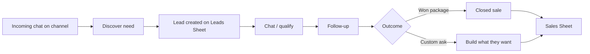

# Dealwire Operator CRM — UI/UX Design

**Brand:** Dealwire  
**Tagline:** Leads in. Deals out.

Skills applied: `frontend-design`, `effective-ui-design`, `ui-design-brain`, `web-design-guidelines`.

## Design plan

| Token | Value | Role |
|-------|-------|------|
| Ink | `#040912` | Atmosphere base |
| Teal accent | `#11d9ca` | Interactive + Leads pipeline |
| Warm highlight | `#e8b86d` | Sales / closed-won |
| Muted | `#9db4c3` | Secondary text (AA on ink) |
| Display | Syne | Confident B2B headlines |
| UI / body | Space Grotesk | Operator density |

**Signature:** Two visually separated ledgers — cool teal **Leads Sheet** (pipeline) vs warm amber **Sales Sheet** (closed book). Never mixed.

---

## 1) Wireframes

### Overview — desktop

```
┌──────────────────────────────────────────────────────────────┐
│ Dealwire   Overview  Leads  Sales  Channels  Setup            │
├──────────────────────────────────────────────────────────────┤
│ Dealwire                                                      │
│ Leads in.                                                    │
│ Deals out.                                                   │
│ Short supporting line…                                       │
│ [Open Leads] [Open Sales] [Channels] [Setup]   │ ● Online   │
│                                                │ WhatsApp   │
├──────────┬──────────┬──────────┬───────────────┤             │
│ New leads│ Follow-up│ Closed   │ Build reqs    │             │
├──────────┴──────────┴──────────┴───────────────┘             │
│ [ Leads Sheet preview ]   [ Sales Sheet preview ]            │
└──────────────────────────────────────────────────────────────┘
```

### Overview — mobile

```
┌─────────────────────┐
│ Dealwire             │
│ Leads in. Deals out.│
│ [Leads] [Sales]     │
│ [Channels] [Setup]  │
│ ● Bot online        │
│ ┌ stats stack ┐     │
│ └─────────────┘     │
│ Bottom: Ov Le Sa Ch │
└─────────────────────┘
```

### Leads Sheet — desktop

```
Sheet 1 · Lead generation
Leads Sheet                         [Download Leads CSV]
Discover → Chat → Follow-up → Proposal
( All active | Follow-up only )
┌ Updated │ Name │ Contact │ Need │ Channel │ Stage │ Msgs │ Last ┐
│ … pipeline rows …                                              │
└────────────────────────────────────────────────────────────────┘
Empty: “No generated leads yet” + Connect a channel
```

### Sales Sheet — desktop

```
Sheet 2 · Closed clients
Sales Sheet                         [Download Sales CSV]
[Closed sale] [Build what they want]
( All closed | Closed sales | Build requests )
┌ Closed at │ Client │ Contact │ Want │ Channel │ Type │ Msgs │ Last ┐
```

### Channels — desktop

```
Channels                    ● Active outbound · WhatsApp
WhatsApp     Active outbound          [Configure]
Telegram     Connected                [Configure]
…
Discord      Not connected            [Connect]
```

### Setup — desktop

```
Lead gen settings
[Lead generation ON/OFF]
Active channel [select]
Service offering [textarea]
CRM export optional [OFF]
[Save lead gen settings]
—— Channel & webhook checklist (existing) ——
```

---

## 2) High-fidelity mockups

Implemented as live templates (source of truth):

| Screen | Route | Template |
|--------|-------|----------|
| Overview | `/operator` | `dashboard.html` |
| Leads | `/leads` | `leads.html` |
| Sales | `/sales` | `sales.html` |
| Channels | `/channels` | `channels.html` |
| Setup | `/setup` | `setup.html` |

Static mockup frames (generated):

| Asset | Path |
|-------|------|
| Overview desktop | `/opt/cursor/artifacts/dealwire-mockups/dealwire-overview-desktop.png` |
| Overview (Higgsfield) | `/opt/cursor/artifacts/dealwire-mockups/dealwire-overview-higgsfield.png` |
| Leads mobile | `/opt/cursor/artifacts/dealwire-mockups/dealwire-leads-mobile.png` |
| Sales desktop | `/opt/cursor/artifacts/dealwire-mockups/dealwire-sales-desktop.png` |
| Channels desktop | `/opt/cursor/artifacts/dealwire-mockups/dealwire-channels-desktop.png` |

---

## 3) Component list

| Component | Usage |
|-----------|--------|
| **Top nav / bottom nav** | Operator IA: Overview, Leads, Sales, Channels, Setup |
| **Brand lockup** | Hero-level Dealwire wordmark |
| **Status pill + pulse** | Bot online / active channel |
| **Stat strip** | Today’s leads, follow-ups, closed, build |
| **CTA group** | Primary Leads, warm Sales, ghost Channels/Setup |
| **Sheet preview pair** | Visual separation of Sheet 1 vs Sheet 2 |
| **Pipeline rail** | Discover → Chat → Follow-up → Proposal |
| **Filter tabs** | URL-backed (`?filter=`) |
| **Data table** | Sticky header, zebra, horizontal scroll on mobile |
| **Stage badges** | Per-stage color + label (not color-only) |
| **Sale type badges** | Closed sale / Build what they want |
| **Channel rows** | Glyph, status badge, Connect/Configure |
| **Toggle** | Lead gen ON/OFF, CRM export optional |
| **Select + textarea** | Active channel, service offering |
| **Empty states** | Leads / Sales copy + recovery CTA |
| **CSV download button** | Client-side export from table |
| **Toast** | Save / download feedback |

---

## 4) UX copy

### Overview
- **Brand:** Dealwire
- **Headline / tagline:** Leads in. Deals out.
- **Support:** Your AI sales desk across WhatsApp, Telegram, Instagram, and every channel you connect.
- **CTAs:** Open Leads Sheet · Open Sales Sheet · Channels · Setup

### Leads Sheet
- **Title:** Leads Sheet
- **Sub:** Active prospects only. Closed clients live on the Sales Sheet.
- **Empty:** No generated leads yet
- **Empty help:** When Dealwire qualifies a chat, it appears here with stage, channel, and the last message.
- **CTA:** Download Leads CSV · Connect a channel

### Sales Sheet
- **Title:** Sales Sheet
- **Sub:** Won outcomes only. Open pipeline lives on the Leads Sheet.
- **Empty:** No closed clients yet
- **Empty help:** When a lead closes as a sale or a build request, it moves here automatically.
- **CTA:** Download Sales CSV · Review open leads

### Channels
- **Title:** Channels
- **Sub:** Discover need, chat, follow up, and close — on the platforms your buyers already use.
- **Statuses:** Active outbound · Connected · Not connected
- **Actions:** Connect · Configure

### Setup
- **Title:** Setup
- **Lead gen hint:** When on, Dealwire discovers need, qualifies chats, and writes to the Leads Sheet.
- **CRM export hint:** Default off. Use the free built-in Leads and Sales sheets unless you need an external CRM webhook.
- **CTA:** Save lead gen settings

---

## 5) User flow



1. Buyer messages any connected channel.  
2. Bot discovers need → row appears on **Leads Sheet** at Discover.  
3. Conversation advances Chat → Follow-up → Proposal (filters highlight due follow-ups).  
4. Close as **Closed sale** or **Build what they want**.  
5. Row leaves the open pipeline and appears only on **Sales Sheet**.  
6. Operator downloads CSV from either sheet; optional CRM export stays off by default.

---

## Motion (intentional)

1. **Page enter** — staggered `panel-enter` / `sheet-in`  
2. **Filter tab switch** — active fill swap (Leads teal / Sales warm)  
3. **Status pulse** — online indicator on Overview + Channels  

All honor `prefers-reduced-motion`.
